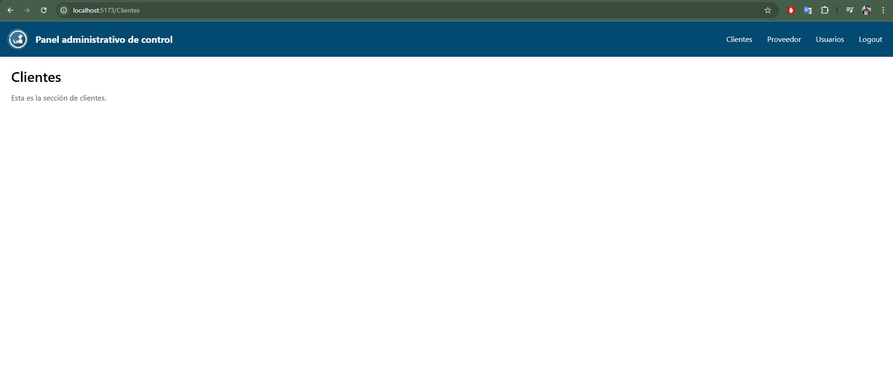

# Panel de Administración React

## Descripción
Proyecto sencillo para gestionar la vista de usuarios, clientes y proveedores, creado con React y Tailwind CSS.

Cuenta con:
 
-Diseño responsive con Tailwind CSS
 
-Configuración optimizada con Vite
 
-Sistema de rutas básico
 
-Estructura modular escalable

Para hacerlo se inicializó el proyecto con Vite y posteriormente se instalaron las dependencias esenciales como lo fue tailwindcss, después modificamos el Tailwind CSS en el archivo **tailwind.config.js** y aplicamos la infraestructura adecuada para el proyecto con diferentes carpetas que mostraban el diseño de cada sección, que por el momeno están bastante simples.

Posteriormente configuramos las rutas en **App.jsx** y ejecutamos el proyecto.

## Cómo Ejecutar proyecto
1. Instala las dependencias:
- **npm install**

2. Inicia el servidor en puerto 5173:
- **npm run dev**
